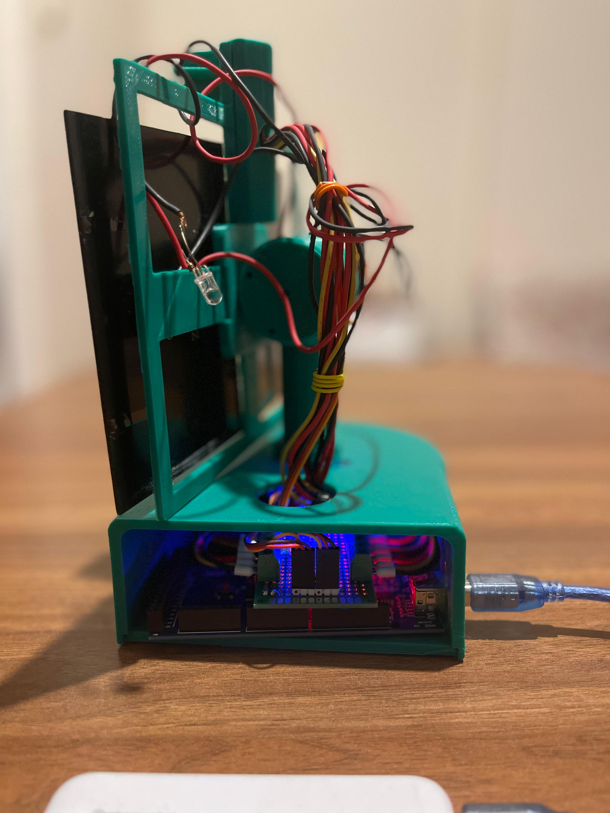
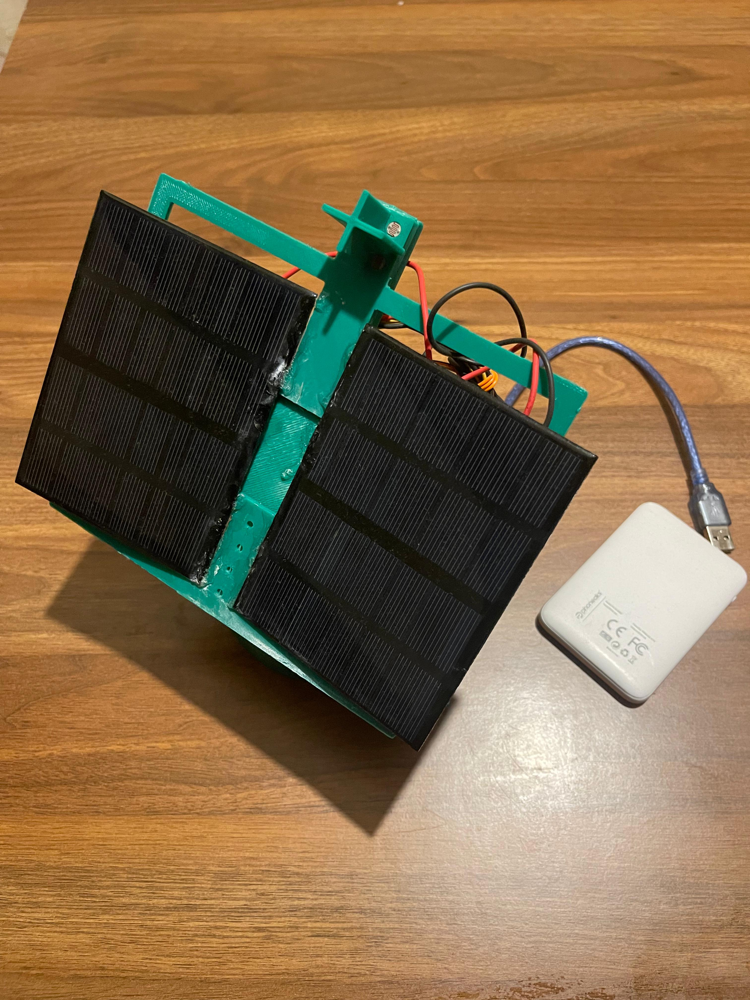
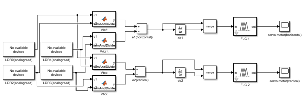
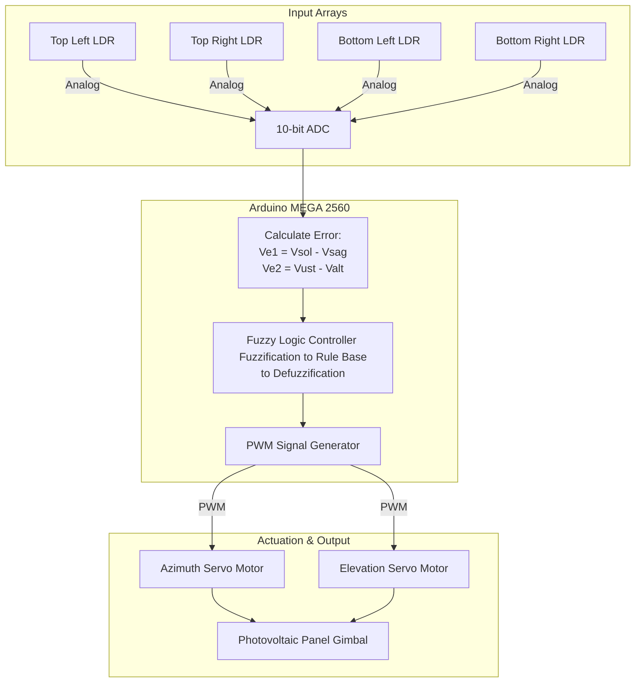
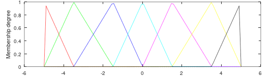

## Dual-Axis Solar Tracker with Fuzzy Logic Control

**Project Overview**

This senior capstone thesis project is an electromechanical prototype designed to maximize photovoltaic (PV) yield through dynamic, dual-axis solar tracking. Moving beyond standard timer-based or threshold-based tracking, this system utilizes a custom Fuzzy Logic Controller (FLC) to process multi-directional light intensity data, smoothly driving azimuth and elevation actuators. Theoretical modeling and empirical testing indicated an estimated 35–40% increase in power capture efficiency compared to static panel configurations, directly contributing to grid-scale green energy optimization strategies.

**System Architecture**

The system employs a closed-loop control architecture, continuously minimizing the differential error between opposing light sensors.

* **Input Stage (Sensor Array):** Four Light Dependent Resistors (LDRs) are arranged in a quadrant topology (Top, Bottom, Left, Right) via voltage divider circuits. These provide continuous analog voltage representations of localized solar irradiance.
* **Processing (Fuzzy Logic Unit):** An Arduino MEGA 2560 samples the ADC values and calculates the horizontal and vertical error differentials ($\Delta E$). Instead of rigid if/else logic, the firmware passes these errors into a Fuzzy Logic algorithm (fuzzification, rule evaluation, and defuzzification) to calculate precise, non-linear corrective angles.
* **Output Stage (Actuation):** The defuzzified output signals drive two discrete servo motors (Pan and Tilt) to mechanically align the PV plane normal to the solar vector.

**Hardware Reality (BOM)**

* **Microcontroller:** Arduino MEGA 2560 (Selected for higher SRAM required by complex fuzzy membership array matrices)
* **Sensors:** 4x Light Dependent Resistors (LDRs) with 10kΩ pull-down resistors
* **Actuators:** 2x Micro Servo Motors (Azimuth and Elevation drives)
* **Energy Harvesting:** Miniaturized Polycrystalline Photovoltaic Panels
* **Chassis:** Custom 3D-printed dual-axis gimbal and sensor-shade housing
* **Infrastructure:** Custom soldered PCB routing, independent DC power bank

**Challenges & Debugging: Control Loop Jitter**

**Issue: Undamped Oscillatory Behavior under High Irradiance**

During physical validation, the mechanical drive mechanism exhibited high-frequency "jitter" (rapid shaking) specifically during peak solar intensity. Analysis revealed that under maximum irradiance, the LDR voltage differentials became hypersensitive. The fuzzy logic controller was reacting to micro-fluctuations in ambient light (and sensor noise), causing the servo control loop to rapidly overshoot and correct without settling.

**Troubleshooting & Validation Steps:**

1. **Signal Smoothing:** Implemented a software-based low-pass filter (moving average array) on the analog LDR reads to dampen electrical noise before it reached the error calculation stage.
2. **Fuzzy Membership Tuning (Deadband Expansion):** Analyzed the fuzzy logic membership functions.

We manually widened the "Zero Error" (Z) membership range, effectively creating a hardware deadband. This forced the system to ignore negligible light differentials, stopping the servos from fighting over minor micro-shadows.
3. **Outcome:** The deadband expansion successfully eliminated the violent shaking, though it highlighted the mechanical limits of relying purely on LDRs without a secondary damping algorithm (like a PID loop) or closed-loop motor encoders.

**Resourcefulness**

While the physical hardware assembly, electromechanical synchronization, and mathematical modeling were executed collaboratively over two semesters, translating complex Simulink fuzzy models into optimized, deployable C++ embedded code presented a bottleneck. We leveraged assistance from field engineers and professors to generate the boilerplate matrix arrays for the fuzzy membership rules and to construct the documentation. 

**Future Expansion & Automation Roadmap**

To evolve this prototype into a viable commercial-grade power system, the following upgrades are required:

* **Hybrid Tracking Algorithm:** Integrating a Real-Time Clock (RTC) and GPS module to calculate astronomical solar positioning. The system would use math to track the sun during cloudy conditions and seamlessly switch to LDR Fuzzy Logic for fine-tuning during clear skies.
* **Sensor Fusion:** Incorporating DHT22 (Temperature/Humidity) sensors to monitor PV thermal degradation, as solar panel efficiency drops under extreme heat.
* **Telemetry & IoT Integration:** Upgrading the MCU to an ESP32 to push live voltage generation data, motor states, and telemetry to a cloud dashboard via Wi-Fi/MQTT for remote industrial monitoring.

## Team & Contributors

This senior capstone thesis was successfully developed and presented collaboratively over two semesters by a four-person engineering team. I want to sincerely thank my project partners for their dedication and specialized expertise:

* **[Abdoul-razaq Yussuf Mbalamula]** - Motor Control & Hardware Integration *(Sensor array implementation and electromechanical actuator synchronization)* - 
* **[Ebuka Uzoegbo]** - Mechanical Design & Electrical Routing *(3D CAD fabrication and physical wiring architecture)* - 
* **[Mert Can Çevik]** - Control Theory & Mathematical Modeling *(Simulink modeling and Fuzzy Logic algorithmic design)* - 
* **[Victor Muya]** - Embedded Software Engineering *(C++ firmware implementation and MCU deployment)* - 
